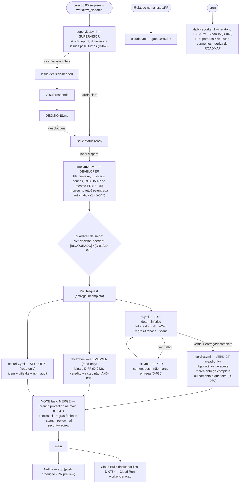

# FACTORY-FLOW.md — Fluxo e modelo mental da fábrica de IA
 
> Como o ciclo autônomo issue → PR → CI → revisão → veredito → merge → deploy funciona,
> papel por papel, e o modelo mental correto para raciocinar sobre ele. Fonte:
> `docs/DECISIONS.md`, `.claude/agents/*`, `.github/workflows/*`.
> **Atualizado 2026-08-10 (EV0.1): incorpora D-028…D-075** (Verdict, publicação não-IA,
> re-entrada, repo público + branch protection, worker Cloud Run).
 
## Modelo mental — a agência de freelancers
 
Pense numa **agência autônoma** da qual você é dono. Há um **agente-gerente** (Supervisor) e
subagentes especialistas: o **Construtor** (Developer), dois **Inspetores** (Reviewer e
Security), um **Reparador** (Fixer) e — desde D-030 — um **Juiz de entrega** (Verdict), que
não escreveu o código e decide se a encomenda está completa. De fora, parece a hierarquia
clássica de agente→subagentes — e serve para entender *quem faz o quê*.
 
A diferença é que, nesta agência, **os freelancers nunca se falam.** Toda a coordenação passa
por um **quadro de tarefas compartilhado** — o GitHub (issues, labels, PRs, comentários e o
status do CI) — com regras de roteamento automáticas. O gerente fixa uma ordem de serviço no
quadro e vai embora. O construtor bate o ponto do zero quando vê `status:ready`, prega o PR no
quadro e sai. O aparecimento do PR convoca os inspetores; o CI verde num PR incompleto convoca
o juiz. Desde D-034, os que só relatam **nem sequer publicam**: escrevem o laudo num arquivo e
um **funcionário administrativo sem IA** (step do workflow) o afixa no quadro.
 
Cada "subagente" é um **freelancer com crachá** (allow-list) que só abre certas portas: o
Construtor e o Reparador têm a chave da oficina (Edit/Write, git); os Inspetores e o Juiz só
têm crachá de leitura (e nem caneta para o mural — D-034); **ninguém** tem a chave do cofre do
merge — essa é sua, agora protegida também por branch protection (D-041).
 
## Orquestração padrão × a sua fábrica (coreografia)
 
O formato padrão é **orquestração** (um agente-maestro central conduz); o seu é
**coreografia** (event-driven, sem cérebro central).
 
| | Formato padrão (orquestração) | Sua fábrica (coreografia) |
|---|---|---|
| Coordenador | um agente (LLM) que raciocina e conduz | **GitHub** (regras fixas) **+ você** (julgamento) |
| Como o trabalho flui | o pai chama o filho e espera | um **evento** no quadro **dispara** o próximo |
| Contexto | herdado na memória do pai | **relido do zero** no quadro (issue/PR/diff) |
| Decisão de rota | dinâmica, pelo agente | **gatilho fixo** (label→workflow, CI vermelho→fix, CI verde+incompleta→verdict) |
| Workers | filhos aninhados | **pares em sessões isoladas** |
 
## Diagrama
 

 
## Quem é quem (papel · gatilho · privilégio)
 
| Workflow | Papel | Gatilho | Escreve código? | Turnos | Guard-rail |
|---|---|---|---|---|---|
| `supervisor.yml` | Supervisor | cron + dispatch | não (cria issues) | 30 | — |
| `implement.yml` | Developer | `status:ready` · dispatch · re-entrada (D-047) | **sim** | 100 (orçamento 40, D-048) | de saída (D-019) + re-entrada |
| `review.yml` | Reviewer | PR | não (read-only, julga o diff) | 80 | veredito por arquivo + step não-IA (D-034) |
| `security.yml` | Security | PR | não (read-only) | 80 | idem |
| `verdict.yml` | Verdict (juiz de entrega) | CI verde em PR `entrega:incompleta` | não (read-only; marca label via step) | 40 | veredito = o próprio step (D-037) |
| `fix.yml` | Fixer | CI vermelho num PR | **sim** | 40 | de saída (D-025) |
| `daily-report.yml` | Relator + alarme | cron | não | 25 | alarmes são não-IA (D-043) |
| `claude.yml` | @claude | menção (gate OWNER) | sim* | — | — |
| `ci.yml` | Juiz determinístico | push/PR | não — sem IA | — | é o próprio gate |
 
Comum a todos: `gh pr merge` fora (merge humano, D-012); rede fora; **PR de fork não aciona
os workflows privilegiados** (`head_repository == repository`, D-039); config de agente
restaurada da base antes de rodar (D-033); credencial limpa do `.git/config` (D-032);
transcrição redigida como artefato (D-024).
 
## Os 5 momentos do ciclo
 
1. **Planejar** — Supervisor lê ROADMAP/DECISIONS, dimensiona a issue para caber em ~40
   turnos (D-048) e abre `status:ready` (ou `decision-needed` se tocar gate).
2. **Implementar** — Developer: PR primeiro, push aos poucos, ROADMAP marcado no mesmo PR
   (D-045). Morreu no teto? O guard-rail re-dispara a sessão no mesmo PR, até 3× (D-047);
   depois `precisa-humano`. Pivotou para gate? PR vira `[BLOQUEADO]` (D-044).
3. **Julgar (paralelo)** — `ci.yml` determinístico; Reviewer e Security julgam o **diff**
   (D-042) e publicam via step não-IA (D-034). CI vermelho → Fixer corrige (e não marca a
   própria entrega — D-030).
4. **Vereditar** — CI verde num PR ainda `entrega:incompleta` aciona o **Verdict**, que
   compara o PR com os critérios de aceite da issue e marca `entrega:completa` ou comenta o
   que falta.
5. **Mergear e publicar** — você confere e faz o merge (branch protection ativa, D-041).
   Push na main publica o app na Netlify e, se tocou a imagem (`includedFiles`, D-075),
   reconstrói e reimplanta o worker no Cloud Run.
## Controles que mantêm a autonomia segura
 
- **Allow-list por papel** (D-012, podada em D-031/D-034): least privilege; quem só relata
  não publica; ninguém mergeia; rede fora.
- **Guard-rails não-IA** de saída (D-019/D-025), de veredito (D-034/D-037) e de re-entrada
  (D-047): matam o "verde sem artefato" em todas as formas conhecidas.
- **Integridade do juiz** (D-033 + verdict.yml): config de agente vem da base; a branch sob
  julgamento não reescreve as instruções de quem a julga; varredura recursiva contra
  CLAUDE.md/settings/skills injetados.
- **Observabilidade**: transcrição como artefato (D-024); alarmes diários não-IA (D-043);
  deriva de ROADMAP denunciada (D-045); label `reentrada:N` auditável (D-047).
- **Decision Gates** (AUTONOMY.md): dinheiro, LGPD, catálogo, segurança e **infra** (D-073 —
  Cloud/IAM só em sessão interativa humana) param e viram `decision-needed`.
- **`settings.json`** (hooks + permissions — consertados em D-031): 2ª camada imposta.
- **Branch protection** (D-041) + repo público (D-039) com gate de fork.
- **Right-sizing** (`.claude/rules/right-sizing.md`): LOW/INFO e hipotéticos se adiam.
## Limitações operacionais conhecidas
 
- O GitHub App **não tem escopo `workflows`**: mudança em `.github/workflows/*` é aplicada
  manualmente pelo dono (padrão desde D-030), e PRs que tocam `review.yml`/`security.yml`
  reprovam por workflow validation (exceção de merge manual do D-014).
- A config dos triggers do Cloud Build vive no console (dívida registrada em
  `docs/DEPLOY-WORKER.md`); o `includedFiles` é cópia manual dos `COPY` do Dockerfile.
- `e2e` está fora dos required checks da branch protection (erro registrado em D-041).
## Onde este arquivo vive e para quê
 
É o **mapa mental da fábrica** — explica *como o sistema autônomo está montado* para
qualquer sessão nova (humana ou IA) sem engenharia reversa dos workflows. Complementa, não
repete: `docs/ARCHITECTURE.md` = arquitetura do produto; `docs/AUTONOMY.md` = o que a IA
decide; `docs/DECISIONS.md` = por quê de cada escolha. Vive **neste Project** (política de
espelhamento no STATE.md); se um dia entrar no repo como `docs/FACTORY.md`, entra pelo fluxo
normal (PR pequeno, merge humano).
 